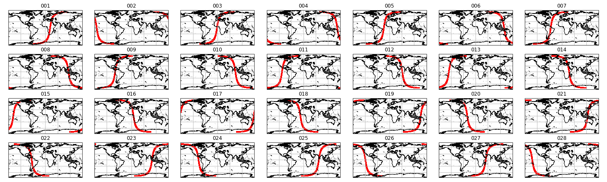
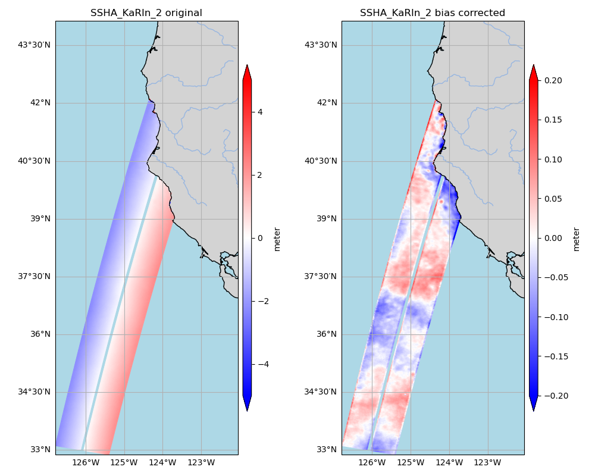
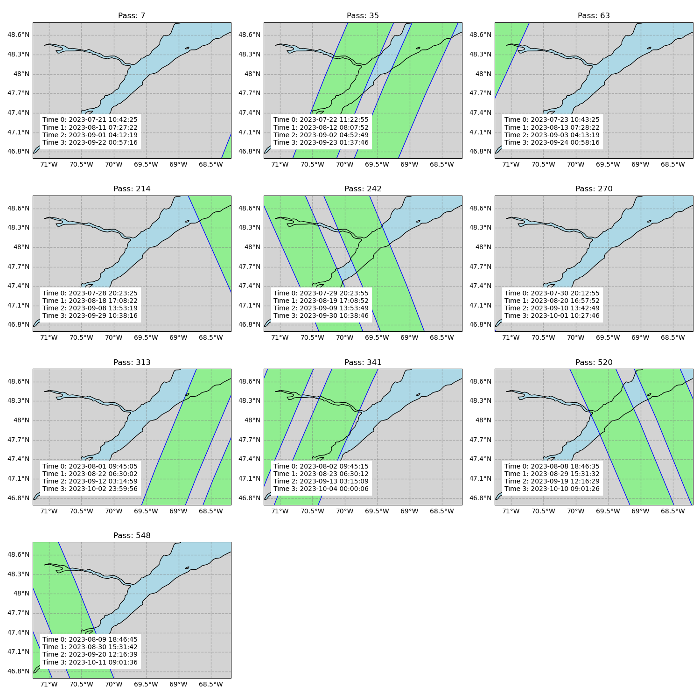

### SWOT-OpenToolkit
An open repository of community-contributed codes for processing SWOT data. Note: Official project algorithms are not included.

The current code focuses on dealing with the KaRIn during the fast-repeat phase. The following image is used to quick search the pass numbers that are relavent to regional interests. 




## Get started 

 #### [This example shows how to do a quick visualization with the existing cross-swath bias removed.](examples/simple_visualization.ipynb). The following is an example output. 



#### [This program finds and plot the science orbit crossing a specified bounding box](src/find_swot_passes_science.py). Run the program as follows:

```
   python find_swot_timing_science.py -sw_corner -130.0 35.0 -ne_corner -125.0 40.0 -output_filename /tmp/test.png
```

   You will get something like the following figure. It contains the pass number, the satellite passing time (UTC) and the associated visualization. \\


