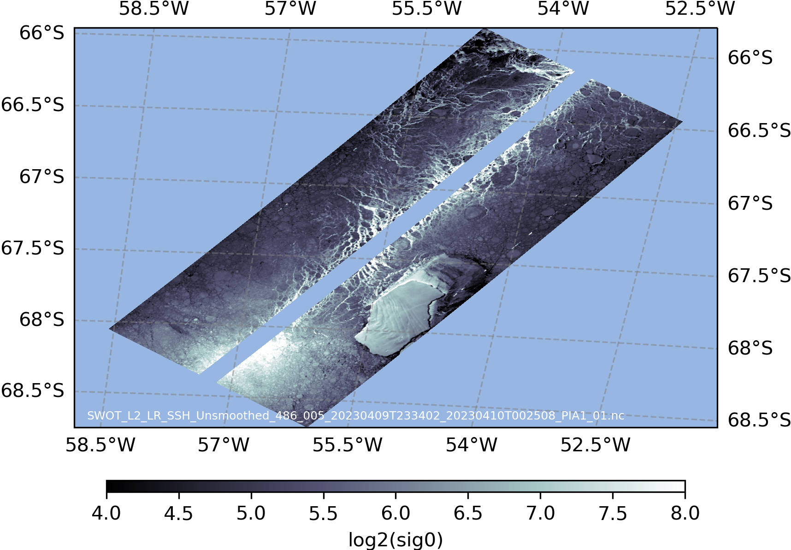
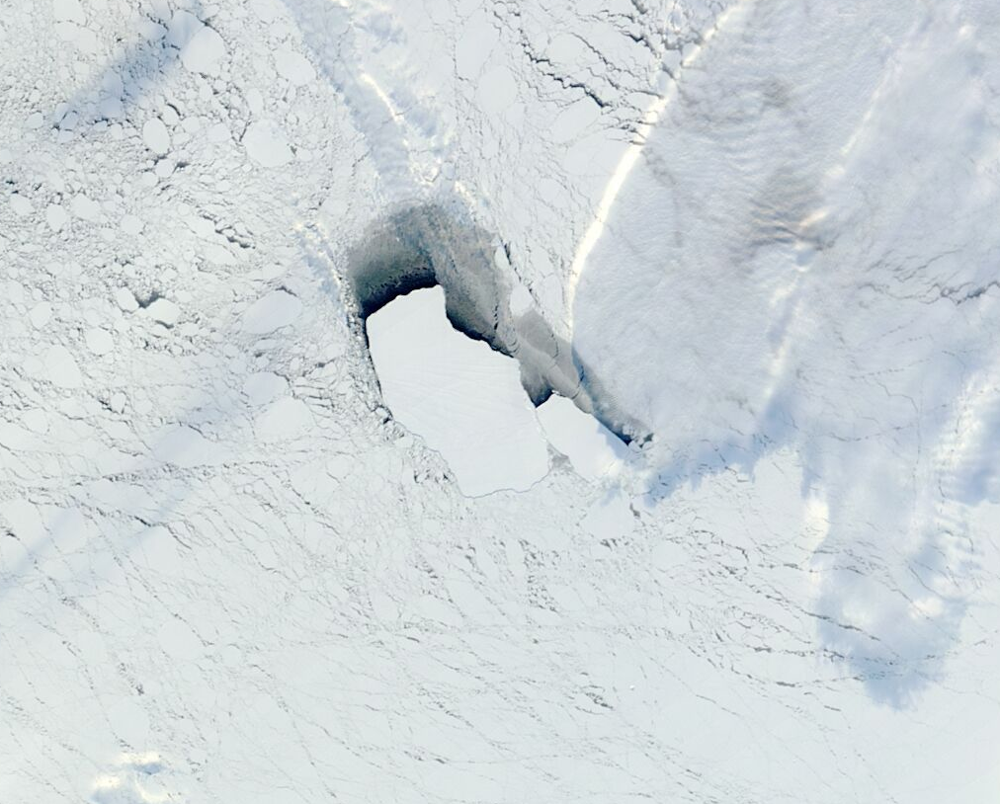

# SWOT-OpenToolkit

An open repository of community-contributed codes for processing SWOT data. Note: Official project algorithms are not included.

The current code focuses on dealing with the KaRIn during the fast-repeat phase. The following image is used to quick search the pass numbers that are relavent to regional interests. 


## Get started 

 - [A Handbook on level-2 SSH products](docs/chap0_get_started.md)
---
## Examples 

1. [Remove cross-swath bias in 2km-resolution ssha_Karin_2](examples/remove_crossswath_bias.ipynb). The following is an example output. 

    

1. [Sea ice and iceberg in sig0 at 250m resolution](examples/unsmoothed_sea_ice_250m.ipynb).

   
   

1. [Identify the pass number and timing of the science orbit over a region](src/find_swot_passes_science.py).

     Run the program as follows:

   ```
      python find_swot_timing_science.py -sw_corner -130.0 35.0 -ne_corner -125.0 40.0 -output_filename /tmp/test.png
   ```

      You will get something like the following figure. It contains the pass number, the satellite passing time (UTC) and the associated visualization. 

   

