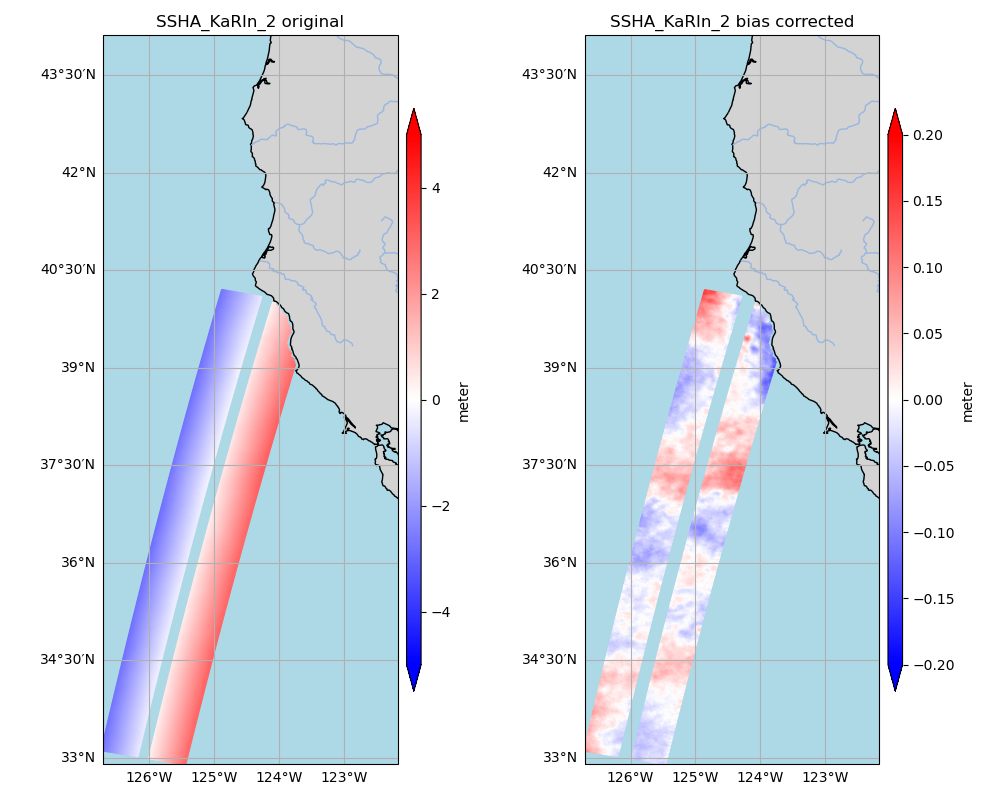

# SWOT-OpenToolkit

⚠️ An open repository of community-contributed codes for processing SWOT data. Official project algorithms are not included.

The current code focuses on dealing with the KaRIn during the fast-repeat phase. The following image is used to quick search the pass numbers that are relavent to regional interests. 


## Get started 

 - [A Handbook on level-2 SSH products](docs/chap0_get_started.md)
 - [How to contribute](contrib/CONTRIBUTING.md)
---
## Quick Examples 

1. [Remove cross-swath bias in 2km-resolution ssha_Karin_2](examples/remove_crossswath_bias.ipynb). The following is an example output. 

    

1. [Sea ice and iceberg in sig0 at 250m resolution](examples/unsmoothed_sea_ice_250m.ipynb).

   
   

1. [Identify the pass number and timing of the science orbit over a region](src/find_swot_passes_science.py).

     Run the program as follows:

   ```
      python find_swot_timing_science.py -sw_corner -130.0 35.0 -ne_corner -125.0 40.0 -output_filename /tmp/test.png
   ```

      You will get something like the following figure. It contains the pass number, the satellite passing time (UTC) and the associated visualization. 

   

1. [Plot the unsmoothed SSH (250m posting) near coast](https://github.com/SWOT-community/SWOT-OpenToolkit/blob/main/examples/unsmoothed_coastal.ipynb) 

   

## Additional Resources:
- **Consider visiting the NASA [PO.DAAC Cookbook: SWOT Chapter](https://podaac.github.io/tutorials/quarto_text/SWOT.html) for more data resources and tutorials related to both the hydrology and oceanography SWOT communities.**
- **Product description documents for every SWOT collection in the table [here](https://podaac.jpl.nasa.gov/SWOT?tab=datasets-information).**
